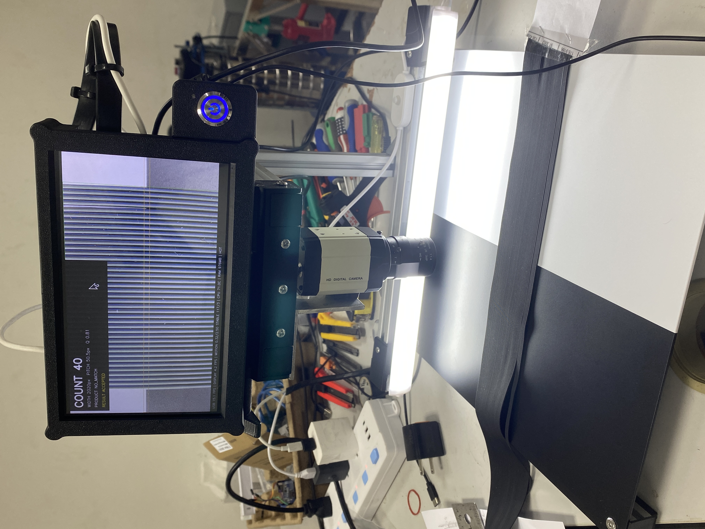
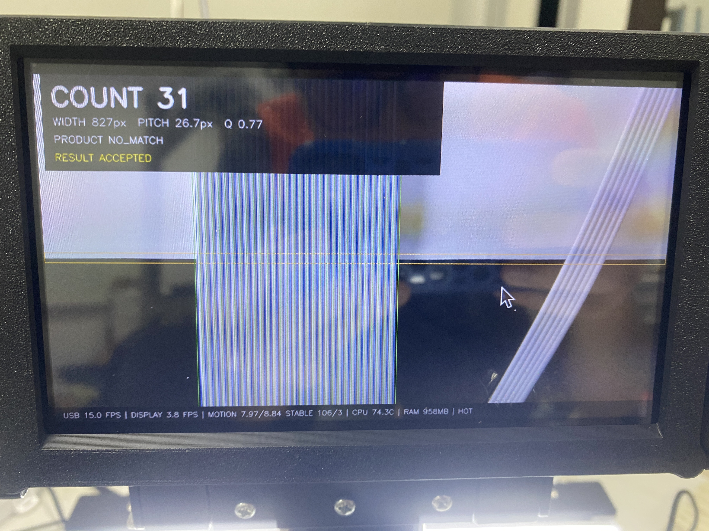
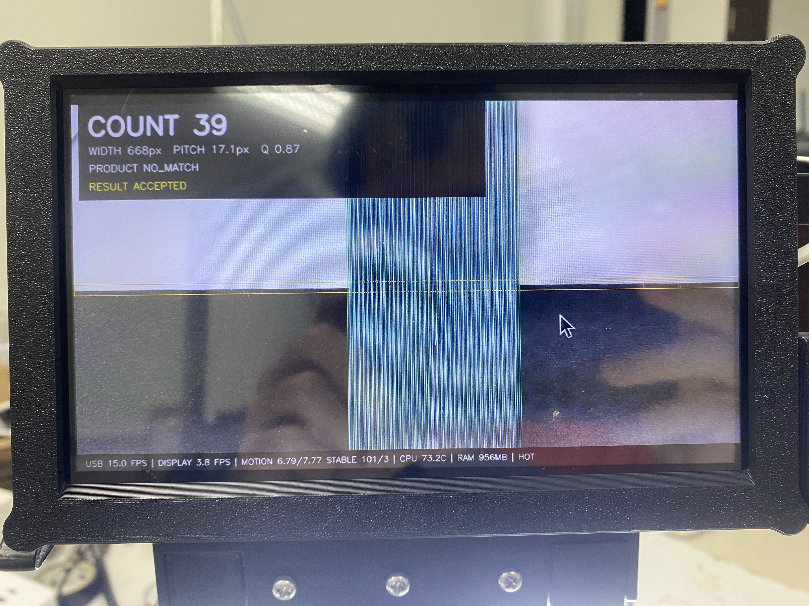
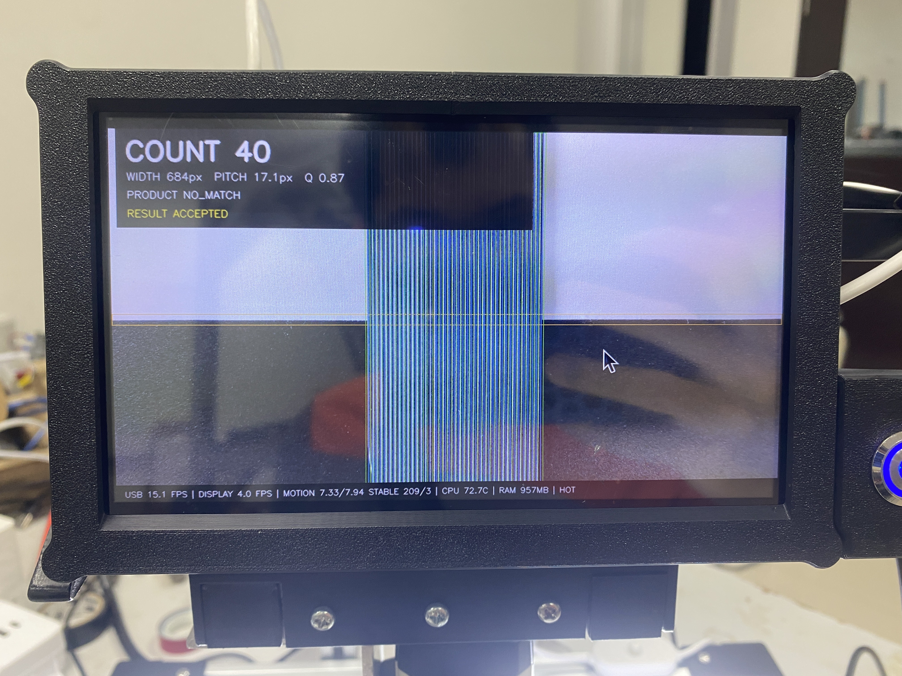

# เครื่องนับจำนวนเส้นด้ายยางธรรมชาติ
## Natural Thread Counter Station

โปรแกรมนับจำนวนเส้นยางในแพแนวตั้งจากกล้อง USB โดยใช้ classical computer
vision ด้วย OpenCV และ NumPy เท่านั้น ไม่ใช้ AI/ML model

milestone ปัจจุบันใช้ Raspberry Pi 5 RAM 2 GB ที่ต่อกล้อง USB 
และจอ HDMI 7 นิ้ว 1024×600 pixel
โดยการรันจะใช้คำสั่ง `./run_pi5.sh`


<table align="center">
  <tr>
    <td align="center" width="50%">
      
    </td>
    <td align="center" width="50%">
      
    </td>
  </tr>
  <tr>
    <td align="center" width="50%">
      
    </td>
    <td align="center" width="50%">
      
    </td>
  </tr>
</table>


## สเปกเครื่องที่ใช้งานจริง

- Raspberry Pi 5 RAM 2 GB, Raspberry Pi OS 64-bit
- standard CPython 3.13.5 (`aarch64`) ไม่ใช้ free-threaded Python
- อะแดปเตอร์ 5V/3A
- กล้อง USB UVC NEOCoolcam NE-82534053, เลนส์ manual 2.8–12 mm
- จอ HDMI 7 นิ้ว 1024×600 โดยจอรับไฟจาก Pi
- ไม่มีพัดลม จึงใช้โหมดลดโหลดและ thermal/power guard

## Milestone ปัจจุบัน

โปรแกรมหลักคือ `pi5_usb_hdmi_station.py` และถูกเรียกผ่าน `run_pi5.sh`
โดยทำงานดังนี้:

- เปิดกล้อง USB ผ่าน V4L2/MJPG ขอภาพ 2560×1440 ที่ 15 FPS
- แสดงภาพเต็มจอ HDMI 1024×600 ที่ประมาณ 10 FPS
- เริ่มตรวจจับอัตโนมัติแบบ continuous ไม่ต้องกดปุ่ม
- ตรวจพื้นหลังครึ่งบนสีขาวและครึ่งล่างสีดำ พร้อมหา seam และ safety margin เอง
- ใช้ grayscale, Dynamic ROI, edge/pitch evidence และรวมหลักฐานจากสองโซน
- รองรับการเติมขอบที่หายไปตาม pitch เมื่อมีหลักฐานเพียงพอ
- ตรวจภาพนิ่งด้วย motion gate ที่ตัดผลกระทบจาก auto-exposure ออก
- เก็บผลครบ 5 เฟรม แล้วใช้ Tukey IQR `Q1 - 1.5×IQR` ถึง `Q3 + 1.5×IQR`
  ตัด outlier และใช้ median เป็นผลสุดท้าย
- วาด bounding box และเส้นกึ่งกลางของเส้นยางแต่ละเส้นบนภาพ
- แสดง `COUNT` แม้ยังจับคู่สินค้าไม่ได้ โดยไม่เดาชนิดผลิตภัณฑ์
- ตั้ง UVC anti-flicker 50 Hz เมื่อกล้องรองรับ
- หลังได้ผลหนึ่ง burst จะพักการวิเคราะห์จนกว่าชิ้นงานจะขยับ เพื่อลดโหลด

ผล regression จากภาพอ้างอิงปัจจุบันคือ `40`, `37`, `40` เส้นตาม ground truth
ครบ 3/3 ภาพ ผลนี้ยังไม่ใช่การรับรองความแม่นยำบน Pi จริง

## เตรียม Raspberry Pi

ต่อจอ HDMI และเปิด Pi ให้เข้าสู่ Desktop ก่อน หากใช้ SSH ให้ Desktop session
บนจอ HDMI ต้องทำงานอยู่แล้ว เพราะโปรแกรมต้องเปิดหน้าต่าง OpenCV บนจอจริง
Raspberry Pi OS รุ่นใหม่ใช้ Wayland เป็นค่าเริ่มต้น และ `run_pi5.sh` จะค้นหา
Wayland/X11 session ให้อัตโนมัติ

ตรวจระบบ:

```bash
uname -m
/usr/bin/python3 --version
/usr/bin/python3 -c "import sys; print(sys.executable); print(sys.version)"
```

ค่าที่ต้องได้:

```text
aarch64
Python 3.13.5
```

ห้ามใช้ virtual environment, `sudo pip`, `opencv-python`,
`opencv-contrib-python` หรือ OpenCV แบบ headless บน Pi รุ่นนี้ เพราะโปรแกรม
ต้องใช้ GUI ของ OpenCV และต้องใช้แพ็กเกจระบบที่เข้ากันกับ Python ของ Raspberry
Pi OS

## ติดตั้งไลบรารีและเครื่องมือทั้งหมด

ติดตั้งลง system Python โดยตรง:

```bash
sudo apt update
sudo apt install -y \
  python3 \
  python3-numpy \
  python3-opencv \
  v4l-utils
```

แพ็กเกจที่โปรเจคใช้มีเพียง:

- `python3-numpy` — array และการคำนวณทางสถิติ
- `python3-opencv` — รับภาพกล้อง, ประมวลผลภาพ และเปิดหน้าต่าง HDMI
- `v4l-utils` — ตรวจและตั้งค่า UVC เช่น anti-flicker

ตรวจ environment ก่อนรัน:

```bash
/usr/bin/python3 pi5_preflight.py
```

Preflight จะตรวจ Python 3.13.5+, ระบบ 64-bit, NumPy, OpenCV GUI,
แพ็กเกจ OpenCV ซ้ำ, กล้อง `/dev/video*`, RAM, อุณหภูมิ และ power-limit flag
ถ้าไม่ผ่านให้แก้ตามข้อความก่อนเปิด station

### กรณีพบ OpenCV จาก pip ซ้ำ

ถ้า preflight แจ้ง `opencv-python` หรือ `opencv-contrib-python` ซ้ำ ให้ถอน
เฉพาะแพ็กเกจ pip ที่ชนกับระบบออกก่อน แล้วติดตั้งแพ็กเกจ apt ใหม่:

```bash
/usr/bin/python3 -m pip uninstall --break-system-packages -y \
  opencv-python \
  opencv-contrib-python \
  opencv-python-headless \
  opencv-contrib-python-headless

sudo apt install --reinstall -y python3-numpy python3-opencv
/usr/bin/python3 pi5_preflight.py
```

`--break-system-packages` ในขั้นตอนนี้ใช้เฉพาะการล้างแพ็กเกจ pip เดิมที่ชนกัน
เท่านั้น หลังจากนั้นไม่ต้องติดตั้งโปรเจคด้วย pip

## อัปโหลดโปรเจคจาก VS Code

ตั้งค่า SFTP ให้ปลายทางเป็น:

```text
/home/rpi5/NRTcounter
```

ใช้คำสั่ง `SFTP: Upload Project` เพื่อส่งไฟล์ทั้งโปรเจคครั้งแรก หลังจากนั้น
บันทึกไฟล์ด้วย `Ctrl+S` เพื่ออัปโหลดไฟล์ที่แก้ไขตามการตั้งค่า SFTP

ตรวจสิทธิ์โฟลเดอร์บน Pi หากจำเป็น:

```bash
sudo mkdir -p /home/rpi5/NRTcounter
sudo chown -R rpi5:rpi5 /home/rpi5/NRTcounter
```

## วิธีรันจริง

หลังอัปโหลดไฟล์แล้ว ให้ใช้เฉพาะคำสั่งนี้:

```bash
cd /home/rpi5/NRTcounter
chmod +x run_pi5.sh
./run_pi5.sh
```

สคริปต์จะตรวจ environment, เชื่อม graphical session บน HDMI, จำกัด native
worker pool และเปิด `pi5_usb_hdmi_station.py` ให้อัตโนมัติ

ถ้ากล้องไม่ใช่ `/dev/video0` สามารถ override เฉพาะครั้งนั้นได้:

```bash
./run_pi5.sh --camera 1
```

กด `Q` หรือ `ESC` เพื่อออกจากโปรแกรมเท่านั้น การจับภาพและการนับไม่ต้องกดปุ่ม

## ค่าป้องกันสำหรับอะแดปเตอร์ 5V/3A

ค่าปัจจุบันอยู่ใน `station_config.json` ส่วน `pi5_hdmi_station` และ
`runtime.rpi5_passive`:

```text
camera request       = 2560×1440 MJPG / 15 FPS
HDMI display         = 1024×600 / 10 FPS
OpenCV threads       = 1
CPU affinity         = cores 0–1 เมื่อมี taskset
analysis gap         = 120 ms
burst/stable frames  = 5 / 3
locator max side     = 1024 px
anti-flicker         = 50 Hz
warning/hot/stop     = 65/70/75 °C
minimum free RAM     = 512 MB
```

เมื่อได้ผลแล้วระบบจะหยุดวิเคราะห์จนกว่าชิ้นงานขยับ การทำเช่นนี้ลด CPU และ
กระแสไฟต่อเนื่อง โดยยังคงรับภาพ 2K จากกล้องไว้

ถ้า `vcgencmd get_throttled` พบไฟตกหรือกำลังถูก throttle โปรแกรมจะหยุด worker
และลดการแสดงผลชั่วคราวเพื่อไม่เร่งโหลดเพิ่ม

## การตรวจกล้องและ flicker

ตรวจอุปกรณ์กล้อง:

```bash
v4l2-ctl --list-devices
v4l2-ctl -d /dev/video0 --list-formats-ext
v4l2-ctl -d /dev/video0 --list-ctrls-menus
```

โปรแกรมจะพยายามตั้ง `power_line_frequency=50 Hz` เอง ถ้ากล้องรองรับ

- ถ้าเฉพาะภาพกล้องสว่าง–มืดสลับ แต่ HUD นิ่ง: ตรวจไฟ LED, exposure และ
  `power_line_frequency`
- ถ้าทั้งภาพ, HUD หรือ backlight จอกะพริบพร้อมกัน: ให้ตรวจไฟเลี้ยงทันที

ตรวจสถานะไฟและความร้อน:

```bash
vcgencmd get_throttled
vcgencmd measure_temp
free -h
journalctl -b -1 -k --no-pager | grep -Ei 'oom|out of memory|killed process|thermal|voltage|watchdog|reset'
```

## ปัญหาที่พบบ่อย

### `qt.qpa.xcb: could not connect to display`

คำสั่งถูกรันโดยไม่มี graphical session ให้เปิด Desktop Autologin:

```bash
sudo raspi-config
```

เลือก `System Options → Boot / Auto Login → Desktop Autologin` แล้ว reboot
จากนั้นรอให้ Desktop ขึ้นบนจอ HDMI ก่อนรัน `./run_pi5.sh` ผ่าน SSH อีกครั้ง

### `WAITING FOR STABLE IMAGE` นานผิดปกติ

ตรวจว่ากล้องและแท่นไม่สั่น, ลดแสงกะพริบ และดูค่า `MOTION` กับ threshold บน HUD
ถ้าภาพนิ่งจริงแต่ยังไม่ผ่าน ให้เก็บค่า motion และรายการ control ของกล้องมา
ตรวจต่อ อย่าปรับ threshold แบบถาวรโดยไม่มีภาพจริง

### `USB camera not found`

ตรวจสาย USB และ index:

```bash
ls -l /dev/video*
v4l2-ctl --list-devices
./run_pi5.sh --camera 1
```

### โปรแกรมถูกหยุดก่อนเปิดหน้าต่าง

อ่านข้อความจาก `pi5_preflight.py` ก่อนเสมอ สาเหตุที่พบบ่อยคือ Python ไม่ใช่
3.13.5, OpenCV ซ้ำ, RAM ต่ำ, อุณหภูมิสูง หรือมี power-limit flag ค้างอยู่

## ไฟล์สำคัญใน milestone นี้

- `run_pi5.sh` — คำสั่งเริ่มระบบที่ใช้จริง
- `pi5_usb_hdmi_station.py` — live station บน Pi และหน้าจอ 1024×600
- `dual_background_counter.py` — grayscale counter พื้นหลังสองสี
- `camera_stream.py` — UVC/V4L2 และ latest-frame reader
- `runtime_control.py` — จำกัด threads, thermal/RAM/power guard
- `pi5_preflight.py` — ตรวจ environment ก่อนเปิด station
- `install_pi5_system.sh` — ตัวช่วยติดตั้งแพ็กเกจ apt
- `station_config.json` — ค่ากล้อง, จอ, burst และ safe profile
- `products.json` — กฎสินค้า ซึ่งปัจจุบันว่างเพื่อไม่ให้เดาชนิดสินค้า
- `image/` — ภาพอ้างอิงและ ground truth
- `results/` — overlay และผลทดสอบที่สร้างขึ้น
- `CONTEXT.md` — บริบทสำหรับกลับมาพัฒนาต่อ
- `AGENT.md` — กฎสำหรับ agent/developer

ไฟล์ `thread_counter_station.py` เป็น implementation รุ่นเก่า ไม่ใช่คำสั่ง
สำหรับเปิด live station บน Pi และไม่ควรใช้แทน `./run_pi5.sh`

อัปเดตเอกสาร: 2026-09-03
